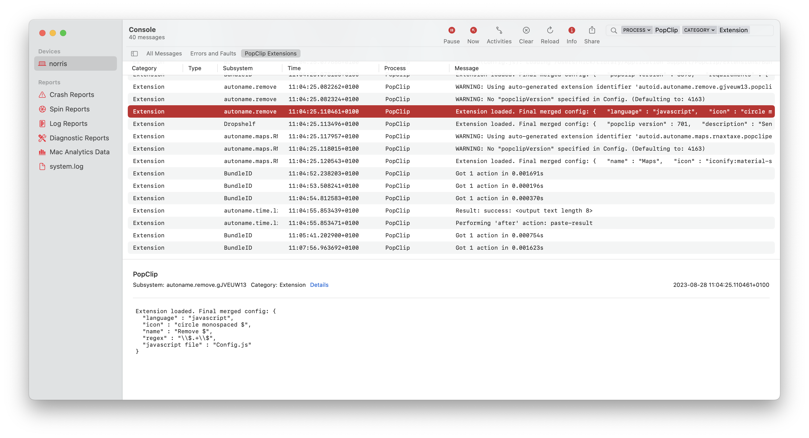
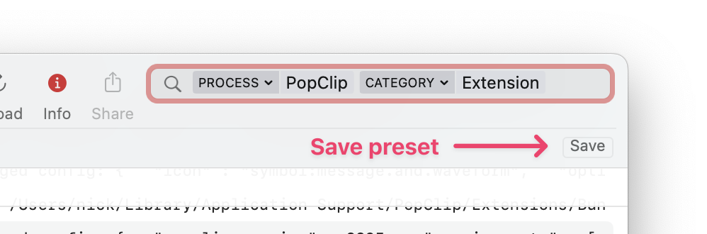

# PopClip Extensions Developer Reference

This section of the documentation provides a detailed specification of PopClip's
extensions architecture. With this information, you can create your own
extensions.

<!-- If you are not a programmer, you may find it easier to use the
[PopClip Extension Creator](https://pilotmoon.com/popclip/extensions/create/). -->

## Extensions Overview

### Snippets and Packages

A PopClip extension can be either a [snippet](./snippets.md) or a
[package](./packages.md). The following table summarizes the differences:

|                 | Snippet                                                | Package                                                                                            |
| --------------- | ------------------------------------------------------ | -------------------------------------------------------------------------------------------------- |
| What is it?     | Plain text in YAML format.                             | A folder containing a config file plus other files such as icons, source files, and a readme file. |
| Install method  | PopClip can load it directly from a text selection.    | Double-clicking it will open it in PopClip.                                                        |
| Distribution    | Can be shared as text, e.g. on forums, pastebins, etc. | Can be downloaded as a file.                                                                       |
| Signing         | Not signed.                                            | Can be signed.                                                                                     |
| Advantages      | Easy to create and share. No need for separate files.  | Easy for end user to install. Allows modular source code with complex functionality.               |
| Disadvantages   | Limited to what can be done with a single text file.   | More complex to create. Steeper learning curve.                                                    |
| File extensions | None (direct selection)  `.popcliptxt` (text file)  | `.popclipext` (folder)  `.popclipextz` (zipped folder)                                          |

<!-- | Philosophy      | "Empowered user" mentality. Visibility promotes learning. | "Developer" mentality. Opaque format keeps everything hidden from end user.                        | -->

### Types of actions

An extension defines one or more actions. Each action can be one of seven types:

| Action Type                               | Description                                                  |
| ----------------------------------------- | ------------------------------------------------------------ |
| [Shortcut](./shortcut-actions)            | Send the selected text to a macOS Shortcut.                  |
| [Service](./service-actions)              | Send the selected text to a macOS Service.                   |
| [URL](./url-actions.md)                   | Open a URL, with the selected text URL-encoded and inserted. |
| [Key Press](./key-press-actions.md)       | Press a key combination.                                     |
| [AppleScript](./applescript-actions.md)   | Run an AppleScript script.                                   |
| [Shell Script](./shell-script-actions.md) | Run a shell script.                                          |
| [JavaScript](./javascript-actions.md)     | Run a JavaScript script.                                     |

### Filter rules

Extensions have access to the following filtering mechanisms, to prevent actions
appearing when they are not useful:

- Filter by current application
- Filter by matching a regular expression against the selected text
- Filter by whether cut, paste or formatting is available
- Filter by whether the text contains a URL, email address or file path
- Filter by the current values of the extensions's options

Filter rules are defined in the
[action properties](./config.md#action-properties) under the `regex` key,
`requirements` key and `required apps`/`excluded apps` keys.

## Extension signing

Please be aware that PopClip extensions can contain arbitrary executable code.
Be careful about the extensions you create, and be wary about loading extensions
you get from elsewhere.

PopClip extensions published in the [directory](/extensions/) are digitally
signed. PopClip will install them directly without showing any warning to the
user. If you create your own extension, it will not be signed. PopClip will
display a warning dialog when you try to install it:

::: tip Snippets

Snippets cannot be signed, but only snippets containing Shell Script actions,
AppleScript actions or JavaScript actions with the network entitlement will
trigger the unsigned warning.

:::

## Development environment

You can create extensions using any text editor. The macOS included app TextEdit
will suffice for simple snippets, but otherwise I recommend using a dedicated
code editor such as [VS Code](https://code.visualstudio.com/),
[Sublime Text](https://www.sublimetext.com/),
[BBEdit](https://www.barebones.com/products/bbedit/) or
[Nova](https://nova.app/).

<EditionSwitcher />

### Turn off unsigned warning

If the unsigned extension warning gets annoying while you are testing your work,
you can turn it off. Run the following command at the Terminal, then Quit and
restart PopClip:

<Ed code base="defaults write com.pilotmoon.popclip LoadUnsignedExtensions -bool YES" setapp="defaults write com.pilotmoon.popclip-setapp LoadUnsignedExtensions -bool YES"/>

### Debug output

To help you when creating extensions, PopClip can be configured to send script
outputs and other debug info to the Console app. To enable it, run this command
in Terminal, then Quit and restart PopClip:

<Ed code base="defaults write com.pilotmoon.popclip EnableExtensionDebug -bool YES" setapp="defaults write com.pilotmoon.popclip-setapp EnableExtensionDebug -bool YES"/>

You can then view the debug output in the Console app.

To filter the Console to show just PopClip extensions, enter Process "PopClip"
and Category "Extension" in the Search field.

You can add this as a saved search by clicking the Save button in the toolbar:

