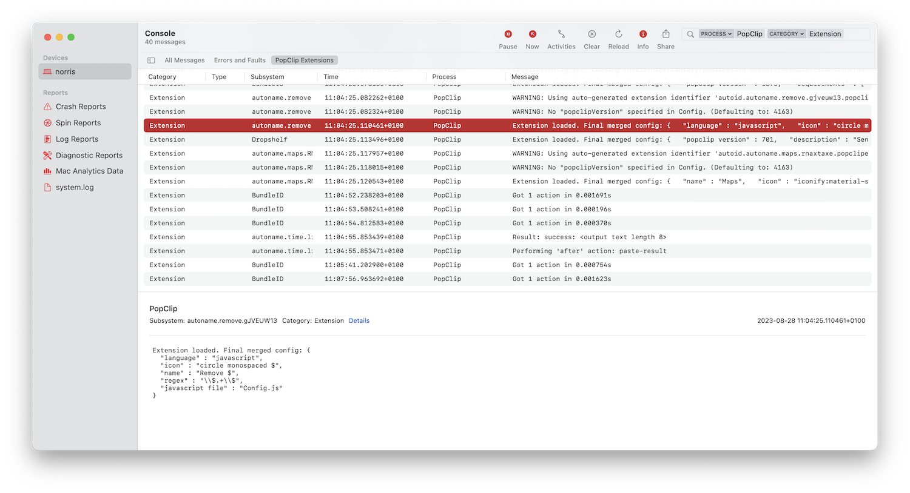

<!-- markdownlint-disable MD025 -->

# :robot: PopClip Extensions Developer Reference

This section of the documentation provides a detailed specification of PopClip's
extensions architecture. With this information, you can create your own
extensions.

::: tip Getting help

If you have any questions about the specification or need help with developing an extension, I encourage you to post to the [PopClip Forum](https://forum.popclip.app).

:::

## Extensions Overview

### Snippets and Packages

A PopClip extension can be either a [snippet](./snippets.md) or a
[package](./packages.md). The following table summarizes the differences:

|                 | Snippet                                                           | Package                                                                                            |
| --------------- | ----------------------------------------------------------------- | -------------------------------------------------------------------------------------------------- |
| What is it?     | Plain text in YAML format.                                        | A folder containing a config file plus other files such as icons, source files, and a readme file. |
| Install method  | PopClip can load it directly from a text selection.               | Double-clicking it will open it in PopClip.                                                        |
| Distribution    | Can be copied and pasted as text, e.g. on forums, pastebins, etc. | Can be downloaded as a file.                                                                       |
| Signing         | Not signed.                                                       | Can be signed.                                                                                |
| Advantages      | Easy to create and informally share. No need for separate files.  | Easy for end user to install. Allows modular source code with complex functionality.               |
| Disadvantages   | Limited to what can be done with a single text file.              | More complex to create. Steeper learning curve.                                                    |
| File extensions | None (direct selection)  `.popcliptxt` (text file)             | `.popclipext` (folder)  `.popclipextz` (zipped folder)                                          |

### Types of actions

An extension defines one or more actions. Each action can be one of seven types:

| Action Type                               | Description                                                  |
| ----------------------------------------- | ------------------------------------------------------------ |
| [Shortcut](./shortcut-actions)            | Send the selected text to a macOS Shortcut.                  |
| [Service](./service-actions)              | Send the selected text to a macOS Service.                   |
| [URL](./url-actions.md)                   | Open a URL, with the selected text inserted as a query.      |
| [Key Press](./key-press-actions.md)       | Press a key combination.                                     |
| [Shell Script](./shell-script-actions.md) | Run a shell script.                                          |
| [AppleScript](./applescript-actions.md)   | Run an AppleScript script.                                   |
| [JavaScript](./js-actions.md)             | Run a JavaScript or TypeScript script.                                     |

### Filter rules

Extensions have access to the following filtering mechanisms to prevent actions
from appearing when they are not helpful:

- Filter by the current application
- Filter by matching a regular expression against the selected text
- Filter by whether cut, paste, or formatting is available
- Filter by whether the text contains a URL, email address, or file path
- Filter by the current values of the extensions's options

Filter rules are defined in the [action properties](./actions) under the `regex`
key, `requirements` key, and `required apps`/`excluded apps` keys.

## Extension signing

Please be aware that PopClip extensions can contain arbitrary executable code.
Be careful about the extensions you create, and be wary about loading extensions
you get from elsewhere.

PopClip extension packages published in the [directory](/extensions/) are
digitally signed. PopClip will install signed extensions without showing any
warning to the user.

If you create your own extension, it will be unsigned. If an unsigned extension
contains Shell Script actions or AppleScript actions, or has entitlements,
PopClip will display a warning dialog when you try to install it:

## Development environment

You can create extensions using any text editor. The macOS-included app TextEdit
will suffice for simple snippets, but otherwise, I recommend using a dedicated
code editor such as [VS Code](https://code.visualstudio.com/),
[Sublime Text](https://www.sublimetext.com/),
[BBEdit](https://www.barebones.com/products/bbedit/), or
[Nova](https://nova.app/).

### Turn off unsigned warning

If the unsigned extension warning gets annoying while you test your work, you
can turn it off. Run the following command at the Terminal, then Quit and
restart PopClip:

`defaults write com.pilotmoon.popclip LoadUnsignedExtensions -bool YES`

### Debug output

To help you when creating extensions, PopClip can send script outputs and other
debug info to the Console app. To enable it, run this command in Terminal, then
Quit and restart PopClip:

`defaults write com.pilotmoon.popclip EnableExtensionDebug -bool YES`

You can then view the debug output in the Console app.

To filter the Console to show just PopClip extensions, enter Process "PopClip"
and Category "Extension" in the Search field.

You can add this as a saved search by clicking the Save button in the toolbar:

