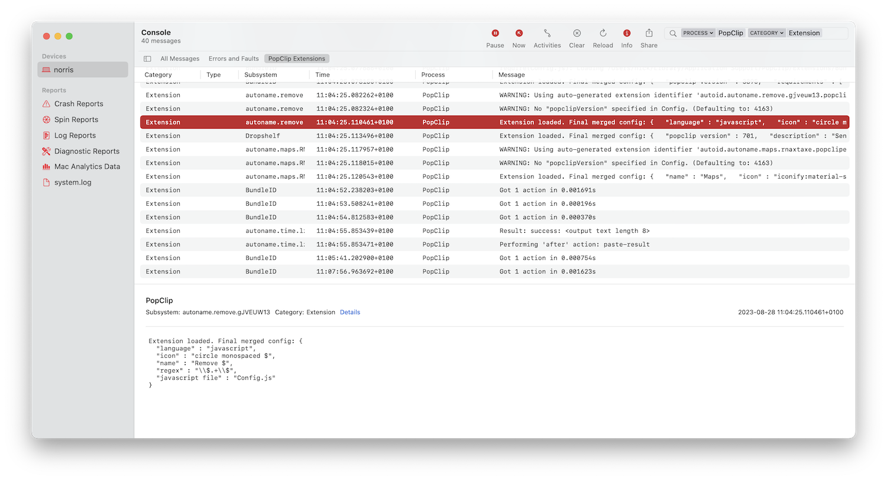
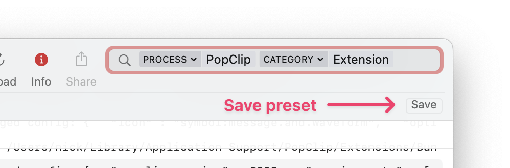

<!-- markdownlint-disable MD025 -->

# :robot: PopClip Extensions Developer Documentation

This section of the website provides a detailed specification of PopClip's
extension system. With this information, you can create your own
extensions.

::: tip Getting help

If you have any questions about the specification or need help with developing
an extension, I encourage you to post to the
[PopClip Forum](https://forum.popclip.app). I frequently check the forum and
will be happy to help you there.

:::

## Extensions Overview

### Actions run JavaScript

An extension defines one or more actions. At heart, an action runs JavaScript
(or TypeScript) in PopClip's [JavaScript environment](./js-environment.md).
The simplest complete extension is a few lines of text:

```js
// #popclip
// name: Say Hi
popclip.showText("hi!");
```

That is a [snippet](./snippets.md) defining a
[JavaScript action](./js-actions.md). For more advanced functionality, a [module extension](./js-modules.md) can define
everything in code: multiple actions, options, and dynamic behavior, via
`defineExtension()`.

### No-code actions

For common tasks, you don't need to write code at all. Four action types are
ready-made conveniences — declarative wrappers around things that can also be
done in JavaScript:

| Action Type                         | Description                                             | JavaScript equivalent      |
| ----------------------------------- | ------------------------------------------------------- | -------------------------- |
| [URL](./url-actions.md)             | Open a URL, with the selected text inserted as a query. | `popclip.openUrl()`        |
| [Key Press](./key-press-actions.md) | Press a key combination.                                | `popclip.pressKey()`       |
| [Service](./service-actions)        | Send the selected text to a macOS Service.              | `popclip.performService()` |
| [Shortcut](./shortcut-actions)      | Send the selected text to a macOS Shortcut.             | `popclip.runShortcut()`    |

### Classic script actions

Two further action types run a script that you provide to be run outside PopClip.
They predate the JavaScript environment, but they remain supported.

| Action Type                               | Description                | JavaScript equivalent      |
| ----------------------------------------- | -------------------------- | -------------------------- |
| [AppleScript](./applescript-actions.md)   | Run an AppleScript script. | `popclip.runAppleScript()` |
| [Shell Script](./shell-script-actions.md) | Run a shell script.        | `popclip.runShellScript()` |

## Snippets and Packages

A PopClip extension can be either a [snippet](./snippets.md) or a
[package](./packages.md). The following table summarizes the differences:

|                 | Snippet                                                                    | Package                                                                                            |
| --------------- | -------------------------------------------------------------------------- | -------------------------------------------------------------------------------------------------- |
| What is it?     | Plain text: a script with a config comment header, or YAML config alone.   | A folder containing a config file plus other files such as icons, source files, and a readme file. |
| Install method  | PopClip can load it directly from a text selection.                        | Double-clicking it will open it in PopClip.                                                        |
| Distribution    | Can be copied and pasted as text, e.g. on forums, pastebins, etc.          | Can be downloaded as a file.                                                                       |
| Signing         | Not signed.                                                                | Can be signed.                                                                                     |
| Advantages      | Easy to create and informally share. No need for separate files.           | Easy for end user to install. Allows modular source code with complex functionality.               |
| Disadvantages   | Limited to what can be done with a single text file.                       | More complex to create. Steeper learning curve.                                                    |
| File extensions | None (direct selection); `.popcliptxt`, `.js`, `.ts`, `.yaml` (text files) | `.popclipext`&nbsp;(folder); `.popclipextz`&nbsp;(zipped folder)                                   |

### Package signing

Packages published in the [directory](/extensions/) are
digitally signed. Signing tells PopClip it can trust the extension. PopClip will install signed extensions without showing any
warning to the user.

If you create your own extension — whether snippet or package — it will be unsigned.

If an unsigned extension contains Shell Script actions or AppleScript actions, or has entitlements,
PopClip will display a warning dialog when you try to install it:


If an unsigned extension is purely JavaScript (with no entitlements)
or contains only the [no-code action types](#no-code-actions), PopClip installs the extension without showing the warning.

## Development environment

### Type definitions

The complete TypeScript definitions for PopClip's JavaScript API are published
as a single file, [popclip.d.ts](/dev/popclip.d.ts). The same definitions are available as the
[`@popclip/types`](https://www.npmjs.com/package/@popclip/types) npm package,
and as browsable HTML in the
[JavaScript API Reference](/dev/api/).

As well as the `popclip` object and other globals available to scripts, this
definitions file describes the extension config format itself.

To point your editor at the definitions, for autocomplete and type checking:

1. Install the package: `npm install --dev @popclip/types`
2. Configure `tsconfig.json`:
   ```json
   compilerOptions: {
     // ...
     types: ["@popclip/types"],
   }
   ```

For more details, see [TypeScript support](/dev/js-environment#typescript-support).

### Turn off unsigned warning

If the unsigned extension warning gets annoying while you test your work, you
can turn it off. Run the following command at the Terminal, then Quit and
restart PopClip:

`defaults write com.pilotmoon.popclip LoadUnsignedExtensions -bool YES`

And if you are working on an extension with the `com.pilotmoon.` identifier prefix:

`defaults write com.pilotmoon.popclip AllowUnsignedReservedPrefixes -bool YES`

### Debug output

To help you when creating extensions, PopClip can send script outputs and other
debug info to the Console app. To enable it, run this command in Terminal, then
Quit and restart PopClip:

`defaults write com.pilotmoon.popclip EnableExtensionDebug -bool YES`

You can then view the debug output in the Console app.



To filter the Console to show just PopClip extensions, enter Process "PopClip"
and Category "Extension" in the Search field.

You can add this as a saved search by clicking the Save button in the toolbar:



## Show off your work

If you create an extension that others might find useful, you are welcome to
submit it for publication in the
[PopClip Extensions Directory](/extensions/). See
[Submit an Extension](/extensions/submit) for how it works.
