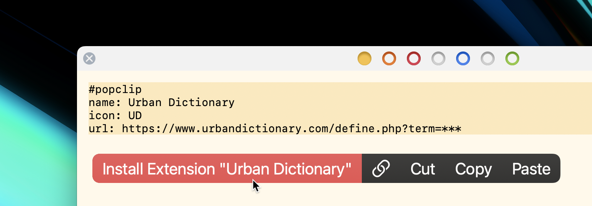
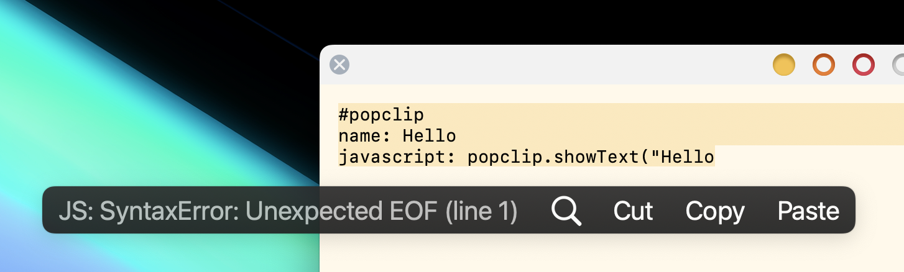

# Snippets

A snippet is the simplest kind of PopClip extension, because it is just plain
text. PopClip can load a snippet directly from a text selection, without the
need for separate files or folders.

## Example

It is easiest to start with an example:

```yaml
#popclip
name: Urban Dictionary
icon: UD
url: https://www.urbandictionary.com/define.php?term=***
```

When you select whole block of text above, PopClip will detect the snippet and
offer an "Install Extension" action.



## Format

A snippet always begins with `#popclip` (or `# popclip`) and can be up to 5000
characters long. It is parsed as [YAML 1.2](https://yaml.org/spec/1.2.2/). The
body of the snippet defines the extension's [config dictionary](./config.md).

::: tip Commments in snippets

Note that `#` begins a YAML comment. Thus the entire snippet including the
`#popclip` line parses as valid YAML.

:::

::: tip Writing snippets in JSON

If you prefer, you can write your snippets in JSON syntax. (From PopClip's point
of view it's still YAML, since JSON is a subset of YAML.)

The following snippet is equivalent to the example above:

```json
#popclip (JSON example)
{
  "name": "Urban Dictionary",
  "icon": "UD",
  "url": "https://www.urbandictionary.com/define.php?term=***"
}
```

Most of the examples in this guide are written in block-style YAML, but I've
included JSON syntax here and there too.

:::

## Creating snippets

PopClip will display any errors it encounters while trying to load the snippet
in the PopClip bar itself.



In the absence of an `identifier` field, the `name` acts as the identifier for
the extension. Installing a snippet with the same name as an existing snippet
will replace it.

A snippet can do everything that a [package](./packages) extension can do. The
only limitation is that it can't refer to any external files.

## More examples

A [Shortcuts](./shortcut-actions) example:

```yaml
# popclip shortcuts example
name: Run My Shortcut
icon: symbol:moon.stars # Apple SF Symbols
macos version: '12.0' # shortcuts only work on Monterey and above!
shortcut name: My Shortcut Name
```

A [Service](./service-actions) example (this time using flow-style YAML markup,
with braces):

```yaml
#popclip service example
{ name: Stickies, service name: Make Sticky }
```

A [Key Press](./key-press-actions) example:

```yaml
#popclip key press example
name: Key Press Example
key combo: command option J
```

An [shell script](./shell-script-actions) example:

```yaml
#popclip shellscript example  
name: Say
interpreter: zsh
shell script: say -v Daniel $POPCLIP_TEXT
```

A [JavaScript](./js-actions) example, including multiple actions:

::: code-group

```yaml
#popclip js + multi action example
name: Markdown Formatting
requirements: [text, paste]
actions:
- title: Markdown Bold # note: actions have a `title`, not a `name`
  icon: circle filled B
  javascript: popclip.pasteText('**' + popclip.input.text + '**')
- title: Markdown Italic
  icon: circle filled I
  javascript: popclip.pasteText('*' + popclip.input.text + '*')
```

```json
#popclip js + multi action example
{
  "name": "Markdown Formatting",
  "requirements": [
    "text",
    "paste"
  ],
  "actions": [
    {
      "title": "Markdown Bold",
      "icon": "circle filled B",
      "javascript": "popclip.pasteText('**' + popclip.input.text + '**')"
    },
    {
      "title": "Markdown Italic",
      "icon": "circle filled I",
      "javascript": "popclip.pasteText('*' + popclip.input.text + '*')"
    }
  ]
}
```

:::

::: warning #1 rule of YAML: Do not indent with tabs!

When writing snippets in YAML with indented parts, as in the example above, do
not use tabs for indenting. YAML does not allow it — use spaces instead.

:::

## Inverted syntax

When writing a snippet containing a script action, we often need to include a
multi-line string for the script. Here's how this is done in pure YAML:

```yaml
#popclip multi-line script with YAML syntax
name: Hello JS
icon: Hi!
javascript: |
  const greeting = "Hello " + popclip.input.text;
  popclip.showText(greeting);
```

In contrast, PopClip also supports an "inside out" approach, which looks like
this:

```javascript
// #popclip multi-line script with inverted syntax
// name: Hello JS
// icon: Hi!
// language: javascript
const greeting = "Hello " + popclip.input.text;
popclip.showText(greeting);
```

This method, which I call **inverted syntax**, offers several benefits: we get
code syntax highlighting and autocomplete from our text editor, and we don't
have to indent the script awkwardly in the YAML.

The inverted syntax is supported for JavaScript, AppleScript and shell script
actions.

When using the inverted syntax, the snippet's whole text becomes the
`javascript file`, `applescript file`, `shell script file`, or `module` for the
extension, accordingly. The config header should be added using the appropriate
comment style for the source language (see [examples](#inverted-syntax-examples)
below).

::: info When to use inverted syntax?

Inverted syntax is most useful for snippets that are primarily scripts. In cases
where the config is quite extensive or where the script is very short, the YAML
approach might still be preferable.

:::

### Inverted syntax config

When using the inverted syntax, the following config fields have special
meanings, to determine what type of action is created:

| Key           | Type    | Description                                                                                                                                                                                    |
| ------------- | ------- | ---------------------------------------------------------------------------------------------------------------------------------------------------------------------------------------------- |
| `interpreter` | String  | When an interpreter is specified, a [Shell Script action](./shell-script-actions) will be created.                                                                                             |
| `language`    | String  | Specify `javascript` or `typescript` to create a [JavaScript action](./js-actions) or [module](./js-modules). Specifiy `applescript` to create an [AppleScript action](./applescript-actions). |
| `module`      | Boolean | For JavaScript and TypeScript language only, set `true` if the source file should be loaded as a module, or `false` (default) if it should be loaded as an action.                             |

::: tip Language field shorthand

You can use `lang` as shorthand for `language`, `js` as shorthand for
`javascript`, and `ts` as shorthand for `typescript`.

:::

### Inverted syntax examples

Here is a Python example:

```python
# #popclip
# { name: Hello Python, icon: hi, after: show-result, interpreter: python3 }
import os
print('Hello, ' + os.environ['POPCLIP_TEXT'] + '!', end='')
```

An alternative way to specify a shell script's interpreter is to put a shebang
(`#!`) line at the top, in which case, the `interpreter` field is not needed:

```python
#!/usr/bin/env python3
# #popclip
# { name: Hello Python 2, icon: hi, after: show-result }
import os
print('Hello again, ' + os.environ['POPCLIP_TEXT'] + '!', end='')
```

An AppleScript example:

```applescript
-- # PopClip LaunchBar example
-- { name: LaunchBar, icon: LB, language: applescript }
tell application "LaunchBar"
  set selection to "{popclip text}"
end tell
```

## `.popcliptxt` files

You can save a snippet to a plain text file with a `.popcliptxt` extension. When
you double-click such a file in Finder, PopClip will load the snippet from the
file and install it. When using this method:

- There is no size limit on the snippet.
- The unsigned extension warning will always be shown.

## Further examples

There are lots of snippet examples posted in the
[PopClip Forum](https://forum.popclip.app/). Here are a few interesting ones
that demonstrate various techniques:

- [Markdown highlighting](https://forum.popclip.app/t/markdown-highlighting/556)
- [A PopClip Extension for ChatGPT](https://forum.popclip.app/t/a-popclip-extension-for-chatgpt/1283)
- [Text-to-speech with Azure API](https://forum.popclip.app/t/new-snippet-azure-text-to-speech/1790)
- [Search DuchDuckGo in DuckDuckGo Browser](https://forum.popclip.app/t/snippet-search-duckduckgo-in-duckduckgo-browser/1763)
- [S p a c e d w o r d s](https://forum.popclip.app/t/s-p-a-c-e-d-w-o-r-d-s/1705)
