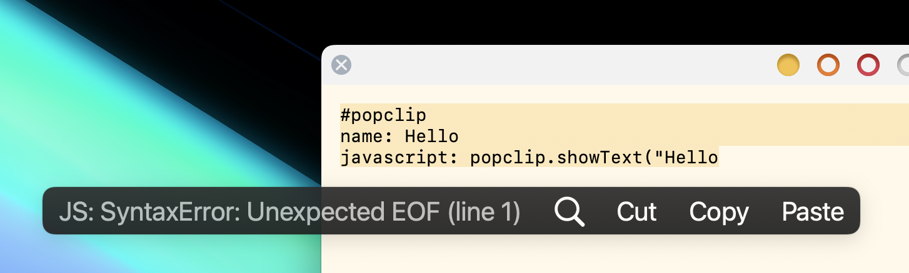

# Snippets

A snippet is the simplest kind of PopClip extension, because it is just plain
text. A snippet begins with a `#popclip` (or `# popclip`) marker line.

```javascript
// #popclip
// name: Hello
// icon: iconify:mingcute:wave-hand-line
const greeting = "Hello, " + popclip.input.text;
popclip.showText(greeting);
```

When you select the text of a snippet, PopClip offers an "Install" action. (Try it!)


::: tip Size limit, and snippet files

When installed via text selection, snippets can be up to 5,000 characters long. Snippet files, on the other hand, have no maximum length.
To install a snippet from a file, save it as a text file with one of these extensions: `.ts`, `.js`, `.yaml` and send it
to PopClip using "Open With" in Finder, or drag the file onto PopClip's menu bar icon. A special file
extension, `.popcliptxt`, can also be used: PopClip opens it when you double-click it.

:::

Snippets come in two forms:

- A **code snippet** is a script, with the extension's config in a comment
  header.
- A **config snippet** is config alone, in YAML format — most useful for the
  [no-code action types](./index#no-code-actions).

## Code snippets {#inverted-syntax}

Here is a complete code snippet:

```javascript
// #popclip
// name: Uppercase
// icon: square filled AB
popclip.pasteText(popclip.input.text.toUpperCase());
```

The config header is a run of comment lines starting at the `#popclip`
marker, containing the extension's [config](./config.md) as YAML. Everything
after the header is the script itself.

Code snippets (formerly called _inverted syntax_) are supported for
JavaScript, AppleScript and shell script actions. The whole text of the snippet becomes the `javascriptFile`,
`module`, `applescriptFile` or `shellScriptFile` for the extension, as
follows:

| To interpret as...            | Include these fields...                                                                                                                                                                                                                                                                              |
| ----------------------------- | ---------------------------------------------------------------------------------------------------------------------------------------------------------------------------------------------------------------------------------------------------------------------------------------------------- |
| `javascriptFile` or `module` | Nothing needed: a code body under a `//` comment header is treated as TypeScript by default. (Specify `language: javascript` to treat as raw JavaScript instead.) A body that exports is loaded as `module` (see [Module detection](./js-modules#module-detection)), otherwise as `javascriptFile`. |
| `applescriptFile`            | Nothing needed: a body under a `--` comment header is treated as AppleScript.                                                                                                                                                                                                                        |
| `shellScriptFile`           | Specify `interpreter`, or start the snippet with a `#!` line.                                                                                                                                                                                                                                        |

### Non-JavaScript snippets

Code snippets are not just for JavaScript — they can also be used with shell scripts and with AppleScript.
The config header should be added using the appropriate comment style for the
source language, as in the examples below.

Here is a Python example, using `#` for the comment header:

```python
# #popclip
# name: Hello Python
# icon: circle hi
# after: show-result
# interpreter: python3
import os
print('Hello, ' + os.environ['POPCLIP_TEXT'] + '!', end='')
```

An alternative way to specify a shell script's interpreter is to put a shebang
(`#!`) line at the top of the snippet, before the `#popclip` marker line. Then the `interpreter` field is not needed:

```python
#!/usr/bin/env python3
# #popclip
# name: Hello Python (shebang)
# icon: circle hi
# after: show-result
import os
print('Hello again, ' + os.environ['POPCLIP_TEXT'] + '!', end='')
```

Using the `--` comment prefix without specifying an interpreter tells PopClip that the body is AppleScript:

```applescript
-- #popclip
-- name: LaunchBar
-- icon: LB
tell application "LaunchBar"
  set selection to "{popclip text}"
end tell
```

## Config snippets

A config snippet is parsed as [YAML 1.2](https://yaml.org/spec/1.2.2/). The
body of the snippet defines the extension's [config dictionary](./config.md).
For example:

```yaml
#popclip
name: Urban Dictionary
icon: UD
url: https://www.urbandictionary.com/define.php?term=***
```

::: tip Comments in snippets

Note that `#` begins a YAML comment. Thus the entire snippet including the
`#popclip` line parses as valid YAML.

:::

### More config snippet examples

A [Shortcuts](./shortcut-actions) example:

```yaml
# popclip shortcuts example
name: Run My Shortcut
icon: symbol:moon.stars # Apple SF Symbols
shortcutName: My Shortcut Name
```

A [Service](./service-actions) example (this time using flow-style YAML markup,
with braces):

```yaml
#popclip service example
name: Stickies
serviceName: Make Sticky
```

A [Key Press](./key-press-actions) example:

```yaml
#popclip key press example
name: Key Press Example
keyCombo: command option J
```

A [shell script](./shell-script-actions) example:

```yaml
#popclip shellscript example
name: Say
interpreter: zsh
shellScript: say -v Daniel $POPCLIP_TEXT
```

A [JavaScript](./js-actions) example, including multiple actions:

```yaml
#popclip js + multi action example
name: Markdown Formatting
requirements: [text, paste]
actions:
  - title: Markdown Bold # note: actions have a `title`, not a `name`
    icon: circle filled B
    javascript: popclip.pasteText('**' + popclip.input.text + '**')
  - title: Markdown Italic
    icon: circle filled I
    javascript: popclip.pasteText('*' + popclip.input.text + '*')
```

::: warning #1 rule of YAML: Do not indent with tabs!

When writing snippets in YAML with indented parts, as in the example above, do
not use tabs for indenting. YAML does not allow it — use spaces instead.

:::

## Developing with snippets

PopClip will display any errors it encounters while trying to load the snippet
in the PopClip bar itself.



In the absence of an `identifier` field, the `name` acts as the identifier for
the extension. Installing a snippet with the same name as an existing snippet
will replace it.

A snippet can do everything that a [package](./packages) extension can do. The
only limitation is that it is completely self-contained: it can't refer to any additional files.
If you want to include a custom icon file, additional source files, or resource files, use a package instead.
