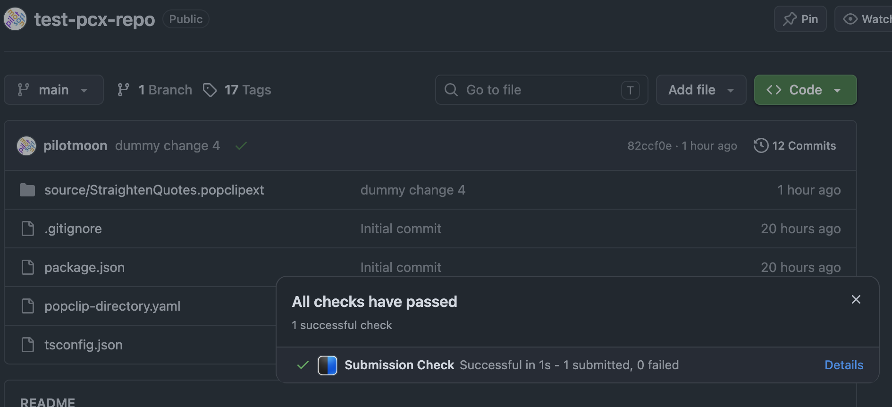

<script setup>
import PopClipVersion from "../src/PopClipVersion.vue";
</script>

<div style="color: var(--vp-c-text-2); margin-bottom: 32px;">
<a href="/extensions/" style="text-decoration: none;">PopClip Extensions Directory</a> / Submit an Extension
</div>

# Submit an Extension

Extensions are submitted from **public GitHub repositories**.

First you will need to publish your extension in a public GitHub repository, if you have not done so already.
Then, configure your repository using the instructions below.

The directory automatically reads your _changed_ extension source files each time you publish a git tag.
It only does this once for each tag, so any change you want to make to a published extension
requires a new tag. ([Monorepos are supported.](#updating-one-extension-out-of-many))

The directory stores copies of the source files and processes them. It will extract metadata
from the Config file and sign and zip the extension.

## Submission agreement

By submitting an extension, you agree to the following. If you don't agree, please don't submit.

- **You keep your copyright.** Your extension remains yours. Nothing here
  transfers ownership of it to me.
- **It's yours to submit.** You wrote the extension, or you otherwise have the
  right to submit it and to give the permissions below.
- **Permission to distribute.** You give me permission, without payment, to store
  your submitted files, to package and sign them, to distribute the result
  through this directory and through PopClip's update mechanism, and to show your
  extension's name, description, icon, readme, author credit, and other content on
  this website and in the PopClip app.
- **Permission for users.** You allow anyone to download and use your extension.
  If you include a license file, that license governs whatever
  else people may do with your code.
- **You are responsible for it.** Be prepared to be contacted by other PopClip users via GitHub about bugs, feature requests, etc.
  Be aware that things may break. For example, a third-party service may change its API, or a macOS update or PopClip update may break something.
- **Do no harm.** It goes without saying that your extension must absolutely respect
  the user and must never do anything to harm the user or their computer.
  Respect their privacy, too: if your extension sends the selected text, or any
  other data, to you or to a third-party service, say so plainly in your readme. Never
  collect or transmit anything the user wouldn't expect.
- **Publication is at my discretion.** I decide what gets published and what
  appears on the front page, and I may unpublish anything at any time.
- **Withdrawal.** [Contact me](/support) if you want your extension unpublished.
  Copies already installed by users are unaffected.
- **No guarantees.** I provide this directory free of charge and as-is, with no
  promise of availability.

## 1. Prepare your extension

### Package

Each extension you want to submit should be a [`.popclipext` package](/dev/packages) within a public GitHub repository you own.

Monorepo-style workflows are supported, so you can include multiple extensions in one repository — see [Updating one extension out of many](#updating-one-extension-out-of-many). Alternatively, you can submit extensions from separate repositories if you prefer.

Example structure:

```
 MyGitHubRepository/
  ∟ LICENSE
  ∟ popclip-directory.yaml
  ∟ source/
     ∟ MyExtension.popclipext/
        ∟ Config.ts
     ∟ MyOtherExtension.popclipext/
        ∟ Config.yaml

```

Do not submit a zipped `.popclipextz` file — it will not work.

::: warning Paths must not change
After you submit an extension for the first time, its source repo and path must not change.
If you rename a package folder, move it within the repo, or move it to a different repo, your next submission will fail.
:::

### Required fields

Your extension's Config **must** contain all of the following, or it will be rejected automatically:

- `name` — the extension name.
- `identifier` — a unique identifier string. This is the primary identifier for your extension
  in the directory and it can never be changed.
- `description` — a concise description to be shown in the directory. Typically one sentence.
- `popclip version` — the minimum required PopClip version as an integer,
  e.g. <code><PopClipVersion build /></code>, which is the current shipping version.
  Normally the version you tested against, but you can set an older version if you want to support older PopClip versions
  and you are sure your extension will be compatible.

Additionally, for extensions with Shell Script actions:

- `shell script rationale` — an explanation of why the extension needs to use a shell script and
  can't be implemented with JavaScript. See [Shell script policy](#shell-script-policy).

### Limits

- No more than **100 files** per extension.
- No single file larger than **1 MiB** (1,048,576 bytes).
- No more than **2 MiB** in total (2,097,152 bytes).

### Readme and demo

You can enhance your directory listing with an optional readme file and demo video ([example](https://www.popclip.app/extensions/x/fwrfay)):

- A Markdown `readme.md` file (any capitalisation) in the root of the package folder is picked up
  automatically and shown on the extension's page.

- A `demo.mp4` or `demo.gif` in the root of the package folder is shown as a looping demo video.

To keep the final file size down, readme and demo files are automatically excluded from the zipped extension that users download.

::: tip Using images in readme files
The readme can include inline images, specified as a path relative to the package root. For example, in markdown: ``.
Use an [underscore name prefix](#hidden-files) to keep images out of the final downloadable zip.

Externally hosted images are not allowed and will be replaced with a "\[Remote image removed\]" placeholder when the readme is rendered.
:::

### Keywords

The directory's search box matches against your extension's **name** and
the names of any associated apps — but **not** its
description. If there are other words people might search for, add a
`keywords` field to your Config:

```yaml
name: Convert
description: Convert between imperial and metric (SI system) units.
keywords: imperial metric si units conversion miles yards feet inches
```

The `keywords` field is one plain string, not an array: just words separated by
spaces. Matching is case-insensitive.

### Changelog

I encourage you to include a changelog to let users know what has changed in each version. Put it at the foot of your readme. Suggested format:

```markdown
## Changelog

- 2026-08-14: Added support for xyz.
- 2026-07-02: Initial release.
```

### Hidden files

Any file or folder within the source package whose name starts with `.` or `_` is automatically excluded
from the final packaged extension.

### Credits

The directory will automatically credit you as the extension's author and maintainer by linking to your repository
and GitHub user page. Put any additional acknowledgements in your readme.

### License

Add a `LICENSE` file in your repository root if you want a licence shown.
GitHub detects it and the directory displays the license name
(such as "MIT License") and a link to the license text.

## 2. Install the GitHub app

Install the **[PopClip Directory GitHub app](https://github.com/apps/popclip-directory)** on the
repository (or repositories) you want to submit from.

I recommend installing it on **selected repositories only** — just the ones
you submit extensions from. Installing on all repositories works too (a
repository takes part only if it contains the configuration file described
below), but selecting repositories keeps the app's access to the minimum.

The app asks for **read access to code**, which GitHub requires for the app
to receive tag-push events and to fetch your extension's files, and
**read and write access to checks**, so it can report results on your commits.
It cannot modify your code.

## 3. Add a configuration file

Create a file called **`popclip-directory.yaml`** in the root of your repository.
Its presence is what opts the repository in. Example:

```yaml
include: "source/*.popclipext"
versionPrefix: v
```

::: warning Glob patterns must be quoted
Strings containing an asterisk (`*`) must be quoted in YAML.
:::

The keys are:

- **`include`** (required) — one or more paths or glob patterns matching your
  extension package folders. Use `.` if the repository root _is_ the package.
- **`exclude`** (optional) — patterns to ignore.
- **`versionPrefix`** (optional) — a prefix your tags use, e.g. `v`. It's
  stripped off to get the version number, and tags without it are ignored.

Example of multiple include patterns:

```yaml
include:
  - Alpha.popclipext
  - Beta.popclipext
versionPrefix: v
```

Example of using `exclude`:

```yaml
include: "*.popclipext"
exclude:
  - Gamma.popclipext
versionPrefix: v
```

In patterns, `*` matches within a single path segment and `**` matches across
segments — so `experimental/*` covers that folder's immediate contents, while
`experimental/**` covers everything beneath it at any depth. (The pattern engine is [picomatch](https://github.com/micromatch/picomatch) with default settings.)

## 4. Tag a version and push

Version numbers are one to four non-negative integers separated by dots, with no
leading zeros. (Zero on its own is fine.)

- Valid: `0.1`, `1`, `1.0`, `159`, `3.6.2`, `5076.95.0.1`
- Not valid: `1.00`, `2.05`, `1.7-beta2`

Each new version must be higher than the last one you submitted.

Tag the release and push the tag along with your branch:

```bash
git tag v1.2
git push origin main v1.2
```

Or publish a release through the GitHub website, which creates the tag for you.

::: tip Tag tips
Tags can be annotated or lightweight, it does not matter.
Make sure to push both the commit itself and the tag. If in doubt, `git push && git push --tags` usually does the trick!
:::

### Updating one extension out of many

A tag covers your whole repository, but that doesn't mean everything in it gets a
new version. For each package matched by your `include` patterns, the directory
compares that package folder's git hash against what it already holds:

- **Unchanged** — skipped entirely. The extension keeps the version it already has.
- **Changed, or new** — submitted, taking its version number from the new tag.

So you can edit one extension in a repository of fifty, push a single tag, and
only that extension gets a new version. (This is how my own [repository of 200+
extensions](https://github.com/pilotmoon/PopClip-Extensions) works.)

One consequence is that each extension's version is the tag in which it last
changed, so version numbers across a repository drift apart. If `Alpha` and
`Beta` are both at `1.0` and you edit only `Alpha` before tagging `v1.1`, then
`Alpha` becomes `1.1` and `Beta` stays at `1.0`. That is normal and expected.

::: tip Starting small
If you have many extensions and would rather submit only one or two to begin
with, name them individually in `include` instead of using a catch-all glob, and
widen it when you're ready.
:::

## 5. Watch for the result

Within a few seconds a check named **Submission Check** appears on the tagged
commit, and completes with a summary of what happened to each package.



You'll also get a **comment on the commit** — and an email, if you have GitHub email notifications enabled for commit comments:

- **Received** — your extension passed the automated checks and is queued for
  review.
- **Could not be processed** — something failed validation. The comment says
  what was wrong. Fix it and push a new tag.
- **Published** — your extension is live, with a link to its page.

## 6. Review and publication

Submissions aren't published automatically — each one is reviewed by hand. This may take several days, or longer, so please be patient.

Once published, your extension gets a page of its own and becomes downloadable as a signed `.popclipextz` file.

Your **author page** lists everything you've contributed and is yours to share:

```
https://www.popclip.app/extensions/authors/your-github-username
```

Extensions on your author page are not listed in the directory's main index right
away. The index is curated: extensions are added to it selectively. A well-named, thoughtfully-designed extension,
with a good icon, a clear open-source licence and a helpful readme makes that more likely, but there are no guarantees. Your
author page link works either way, so you can share your extension immediately.

All published extensions (whether listed in the main index or not) are eligible for automatic updates within the PopClip app.
Updates are subject to the same review as initial submissions.

## Shell script policy

Extensions submitted to the directory should use [**JavaScript actions**](/dev/js-actions) in
preference to Shell Script actions. Use a shell script only when the action
genuinely needs one to do something that would be impossible with PopClip's
internal JavaScript API.

If your extension does have a Shell Script action, its Config must include a
`shell script rationale` field giving a brief explanation (at least 20 characters) of why the
action needs a shell script:

```yaml
shell script rationale: Sends the selected text to the printer using lpr.
```

**A submission with a shell script action and no rationale is rejected
automatically.** Add a rationale only when the action genuinely cannot be done in JavaScript.
Otherwise, you should port the extension to JavaScript before submitting again.

Why? Shell scripts run with full user privileges and can access anything on the
user's Mac. They require a much higher level of scrutiny and are thus more demanding to review.
For that reason, I only want to have to review and sign shell scripts if they are absolutely necessary
for the function of the extension.

JavaScript actions
run in PopClip's sandboxed [JavaScript environment](/dev/js-environment) and can
work with the selected text, clipboard, apps and URLs, and with the `network` entitlement they have [network access](/dev/js-environment#network-access-from-javascript) for making API calls.
JavaScript actions execute more quickly too, since they don't have to shell out to an external task.

::: info Example: the same action, both ways

A shell script action that searches GitHub for the selected text and opens the
first matching repo, as an installable [snippet](/dev/snippets) — select the
whole block and PopClip will offer to install it:

```sh
#!/bin/sh
# #popclip
# name: Lucky Repo (sh)
json=$(curl -s "https://api.github.com/search/repositories?q=$POPCLIP_URLENCODED_TEXT")
url=$(echo "$json" | python3 -c "import json,sys; print(json.load(sys.stdin)['items'][0]['html_url'])")
open "$url"
```

This is a carefully written script: it quotes its variables and uses PopClip's
pre-encoded `POPCLIP_URLENCODED_TEXT` instead of interpolating the raw
selection. Even so, it has to bring in an external tool to parse the JSON —
here `python3`, which macOS doesn't ship. It spawns three processes to
do what is really one HTTP request. And it runs with full user privileges, so
a reviewer still has to read it defensively.

The same action as JavaScript:

```js
// #popclip
// name: Lucky Repo (js)
// language: javascript
// entitlements: [network]
const axios = require("axios");
const response = await axios.get("https://api.github.com/search/repositories", {
  params: { q: popclip.input.text }, // encoded correctly, automatically
});
popclip.openUrl(response.data.items[0].html_url);
```

Nothing to escape, nothing to install, no processes spawned. Even the last line is
better: the shell's `open` can only launch the default browser, while
`popclip.openUrl()` opens the link in the browser the user is actually working
in, with PopClip's usual modifier behaviours like holding Shift to open it
in the background.

:::

This policy applies not just to Bash/Zsh etc., but any script executed using the Shell Script action type. This includes Python, Ruby, Perl, etc.

## Troubleshooting

- The GitHub repository must be **public**.
- The [PopClip Directory app](https://github.com/apps/popclip-directory) must be installed on that repository.
- `popclip-directory.yaml` must be in the repository **root** of the tagged
  commit, and its `include` patterns must actually match your package folders.
- The tag must match your `versionPrefix`, if you set one.
- You must actually push the tag to GitHub as well as the commit.
- An extension with a shell script action must have a
  [shell script rationale](#shell-script-policy) in its Config.
