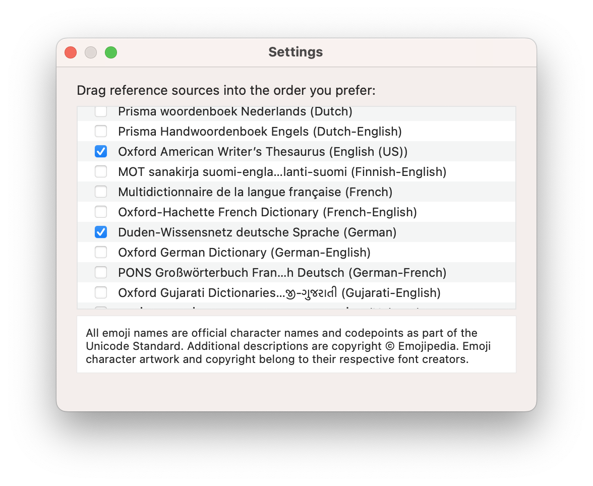

# Actions

The buttons that appear in the PopClip bar perform **actions**. PopClip comes
with a set of built-in actions, and you can add more by installing
[extensions](./extensions).

::: info :thinking:&ensp;Missing actions?

Actions are context-sensitive, and only appear when relevant. So you won't
always see all the actions in the PopClip bar. See:
[Why are some actions not appearing?](/kb/troubleshooting#why-are-some-actions-not-appearing)

:::

## Built-in actions

### <InlineIcon spec="bundle:cut" /> <InlineIcon spec="bundle:copy" /> <InlineIcon spec="bundle:paste" /> Cut, Copy and Paste

The Cut, Copy and Paste actions work just like the usual clipboard functions on
your Mac.

::: tip Paste without selecting text

To make PopClip appear without selecting any text,
[long press](/guide/basics#long-press-with-the-mouse-or-trackpad) the mouse or
trackpad button.

:::

**Availablilty:**

- Copy: requires a text selection.
- Paste: requires text on the clipboard and an editable text field.
- Cut: requires a text selection and an editable text field.

**Modifiers:**

Hold **Shift (⌥)** to perform the action with plain text only. This will
remove any formatting from the text.

**Settings:**

- **Show as Icon**: When enabled, shows the actions's button as an icon instead
  of text.

### <InlineIcon spec="bundle:search" /> Search

The Search action opens a web search for the selected text. The default search
engine is Google, but you can change this in the actions's settings.

Searches open in the current app if it is a [known browser](/kb/browsers), or else 
in the system default browser.

**Availability:**

Always available, subject to a maximum length limit.

**Modifiers:**

Hold **Shift (⇧)** to copy the search URL instead of opening it.

**Settings:**

- **Search URL**: The URL of the search engine. The placeholder `***` will be
  replaced with the selected text. For example, the default Google search URL is
  `https://www.google.com/search?q=***`.

### <InlineIcon spec="bundle:link" /> Open Link

The Open Link action opens any web URLs (`http:` and `https:`) detected in the
selected text. If the text contains multiple web URLs, all of them will open in
separate tabs. The action will also detect "URL-like" text lacking a scheme
prefix and add `https:` when opening it.

URLs open in the current app if it is a [known browser](/kb/browsers), or else 
in the system default browser.

In addition to web URLs, PopClip detects single instances of the following URL
schemes: `evernote:`, `omnifocus:`, `spotify:`, `ftp:`, `bluesky:`, `hook:`,
`craftdocs:`, `x-devonthink-item`.

**Try it:** `https://apple.com` `xkcd.com`
`spotify:track:421Gp1eSmOIcD6alTWowFR`

**Availability:**

Only available if the selected text contains URL. The URL must appear in the
text itself; links that are behind hyperlinks cannot be detected.

**Modifiers:**

Hold **Shift (⇧)** to copy the URLs to the clipboard as a list, instead of
opening them.

**Settings:**

None.

### <InlineIcon spec="bundle:book" /> Dictionary

The Dictionary action looks up the selected text in the macOS Dictionary app.
The Dictionary app will open and show the definition of the word.

**Availability:**

Only available if the selected text is a word in one of the dictionaries enabled
within the macOS Dictionary app. (PopClip restart may be needed after enabling
new dictionaries.)

**Modifiers:**

Hold **Shift (⇧)** to copy the dictionary definition to the clipboard instead of
opening in the Dictionary app.

**Settings:**

The action has no settings, but you can change the dictionaries that are enabled
in the settings of macOS Dictionary app.

### <InlineIcon spec="bundle:folder" /> Reveal in Finder

The Reveal in Finder action opens the folder containing the selected file path,
or, if the selected text is a folder path, opens the folder itself.

**Try it:** `~/Documents` `/Applications/`

**Availability:**

Only available if the selected text is a file or folder path.

**Modifiers:**

None.

**Settings:**

None.

### <InlineIcon spec="bundle:spelling" /> Spelling

The Spelling action shows a list of spelling suggestions for the selected word.
Click a suggestion to replace the selected text with it.

Spelling may be checked against up to two different languages, configurable in
settings.

This action has a special behaviour, appearing as a submenu in place of the
regular PopClip bar. You can click the up-arrow button to return to the regular
PopClip bar.

The action uses the macOS system spellchecker behind the scenes, so the spelling
suggestions will be similar those that appear in other places in macOS.

**Availability:**

Available if the selected text is:

- a single word,
- misspelled in at least one of the enabled languages,
- the spellchecker has spelling suggestions, and
- the text is editable.

If the selected text is a valid word in one of the enabled languages, the action
will appear in the regular PopClip bar only. Otherwise, the spelling suggestions
submenu will appear directly.

**Modifiers:**

Hold **Shift (⇧)** to copy the spelling suggestion to the clipboard instead of
replacing the text.

**Settings:**

- **Languages**: You can select up to two languages for spellchecking, choosing
  from any that are available on the operating system. If you only want to check
  spelling in one language, leave the second language set to "None".
