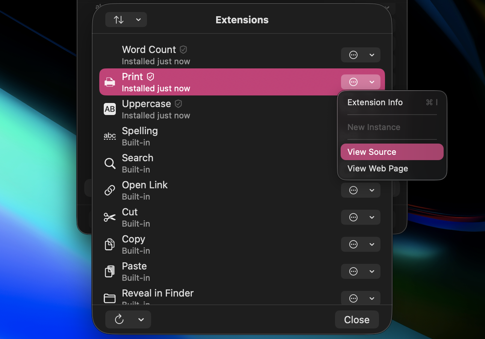
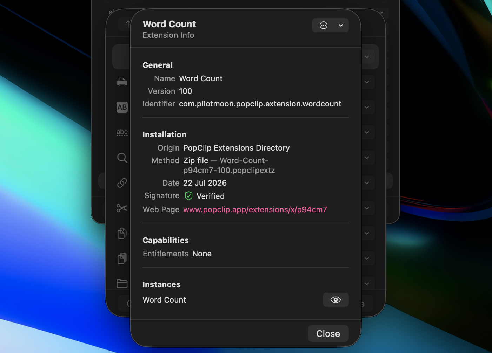

<script setup lang="ts">
import DirectoryCount from '/src/DirectoryCount.vue'
</script>

# Extensions

Extensions add new actions to PopClip. You can install ready-made extensions and
also create your own.

## Extensions and Actions — what's the difference?

The two terms are related but distinct:

- An **action** is a button that appears in the PopClip bar. Actions are what
  you see, use, and arrange in the [Actions tab](./settings#actions-tab).
- An **extension** is a package that _provides_ an action. Extensions are what
  you install, update and remove.

When you install an extension, an action for it is added to the actions list.
But a single extension can provide
**multiple instances** of its action, each with its own name, icon, settings
and position in the bar. For example, you could set up one translation
extension as two actions, each translating to a different language. To create
another instance of an action, use the **Duplicate** command — see
[Organizing Actions](./organizing#duplicating-actions).

PopClip's [built-in actions](./actions) work the same way: they are provided
by built-in extensions that come with the app.

Deleting all of an extension's actions from the actions list also uninstalls
the extension itself. The exception is built-in extensions, which are never
uninstalled — a deleted built-in action can be restored from the
[Manage Extensions](#managing-installed-extensions) sheet at any time.

::: tip Get stuck in!

Browse the [PopClip Extensions Directory](/extensions/) which currently
contains&#x0020;<DirectoryCount /> extensions.

:::

## Installing a downloadable extension

When you download a ready-made extension it will have the file extension
`.popclipextz` or `.popcliptxt`. Simply open the file to add the extension to
PopClip.


### Unsigned Extensions

If you see an "Unsigned Extension" warning it means the extension runs code that
has the potential to access files on your machine or access the internet, and is
not from PopClip's developer. You will need to confirm whether you want to
install the extension.


::: warning

Beware of extensions from untrusted sources as they can potentially be
malicious.

:::

## Installing a snippet

PopClip can load extensions directly from a special plain text format called a
"snippet". Snippets are useful for creating quick extensions and sharing them as
plain text, without having to create a file. Snippets can be shared in emails,
forums, on websites — anywhere you put plain text.

Here is an example snippet, which defines an action for searching Emojipedia for
the selected text:

```text
#popclip extension to search Emojipedia
name: Emojipedia
icon: search filled E
url: https://emojipedia.org/search/?q=***
```

To install that, you select the text and then click the action _Install
Extension "Emojipedia"_ that appears in the PopClip bar.


:::tip Snippet format

Notice that the first line of the snippet starts with `#popclip`. This is a
special marker that tells PopClip that this is a snippet. For more about
snippets, see [Snippets](/dev/snippets) in the developer reference.

:::

## Managing installed extensions

To see a plain list of every installed extension, open the **Manage
Extensions** sheet: click the Tools menu at the bottom of the
[Actions tab](./settings#tools-menu) and choose **Manage Extensions…**
(shortcut: `⌘E`).



The list can be sorted by name or by install date. From each extension's
commands menu you can:

- view [Extension Info](#extension-info);
- create a **New Instance** of the extension's action in the
  PopClip bar;
- use **View Source** to inspect the extension's source code;
- use **View Web Page** to visit the extensions directory page on the web.

### Extension updates

Extensions installed from the
[PopClip Extensions Directory](/extensions/) can update to new versions
automatically. Use the **Updates** menu in the Manage Extensions sheet to
check for updates, and to turn **Update automatically** on or off.

### Extension Info

To see information about an extension, choose **Extension Info** from the
extension's commands menu.



The info sheet shows the extension's origin (for example, the Extensions
Directory, or a snippet), its version, when and how it was installed, and its
signature status.

### View Source

The **View Source** command Reveals a folder in Finder containing a copy of this extension source files.

PopClip will not see any changes you make in this folder and it will revert any edits you do make. If you want to edit the files to make a custom extension, copy the folder elsewhere and rename it with a [.popclipext](/dev/packages) suffix. Then double click that folder to install it as a new extension.

## Creating your own extension

For more about creating both snippets and downloadable extensions, see
[Extensions Developer Reference](/dev/).
