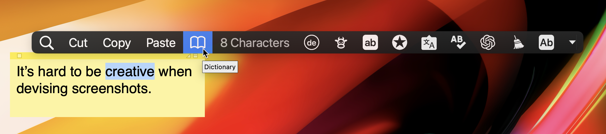

# Introduction

## What is PopClip?

**PopClip is a Mac utility tool that pops up with a menu of actions when you select text on your screen.**

Actions range from simple copy and paste to more complex tasks such as translating text. Using [extensions](/extensions/), you can add actions to PopClip to adapt it your needs. Extensions can connect to various apps and services directly, allowing you to perform actions such as sending text to a note-taking app or searching for text on a search engine.

Think of PopClip as a context-aware assistant that provides you with tools you can use instantly, without having to switch between apps or windows.

PopClip is a [paid](/buy) app, with a [free trial](/download) available. It has been in continuous development since 2011.

## **Contents**

The user guide is divided into the following sections:

1. [**Installation**](installation): Step-by-step instructions on how to obtain PopClip and get it up and running on your Mac.

2. [**Basic Usage**](basic-usage): The fundamentals of PopClip: how to get the PopClip bar to appear and disappear, and a tour of the built-in actions.

3. **Settings**: Comprehensive overview of PopClip's settings. Learn how to customise PopClip to suit your needs.

4. **Extensions**: Learn how to enhance PopClip with the addition of extensions. I guide you on how to install and manage these extensions.

5. **Support & Feedback**: Details on how you can reach out for help or provide feedback.

Beyond the user guide, the documentation includes:

* **App Information** including download links, version history, and purchase information.

* The **Knowledge Base** section, with detailed information about compatibility with other apps, troubleshooting tips, FAQs and technical information.

* **Developer Reference** documentation for creating your own PopClip extensions.
  
All the documentaiton can be found in the sidebar.

 <!-- **Troubleshooting & FAQs**: Solutions to common problems you might face while using PopClip, as well as answers to frequently asked questions. -->

## About this app

### About the developer

PopClip is not made by a large company or even a small team; it's made by one person. [Pilotmoon Software](https://pilotmoon.com/about/) is a name I use for my business but it's just me, a solo developer, Nick Moore. I'm also the one writing this user guide. I had the idea for PopClip in 2011 and I've been working on it ever since. I'm from the UK and my native language is English.

### Languages

PopClip's user interface is available in the following languages: English, French, German, Italian, Japanese, Korean, Portuguese, Russian, Simplified Chinese, Slovak, Spanish, Traditional Chinese and Turkish. The language is automatically selected based on your Mac's language settings.

The documentation only available in English.
