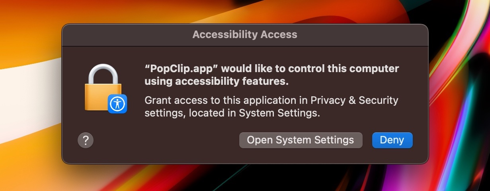
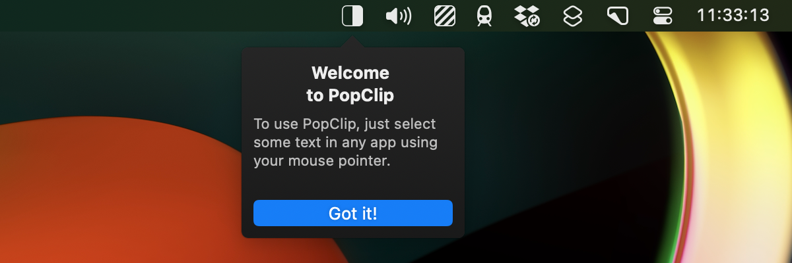

# Installation

<InfoBox />

This page will guide you through the process of obtaining and installing PopClip
on your Mac.

## Obtaining PopClip

There are 2 ways to obtain PopClip:

- **Standalone (free trial, unlockable with license key)**: Download PopClip
  from the [downloads](/download) page on this website. The download is a zip
  file containing the PopClip app. Unzip the file and drag the PopClip app to
  your Applications folder.

<!-- - **Mac App Store**: PopClip is available to buy on the Mac App Store as a
  one-time purchase. <AaLink cfg="mas.storeUrl">View PopClip on Mac App
  Store</AaLink>. -->

- **Setapp**: <AaLink cfg="setapp.referralUrl">Setapp</AaLink> is a subscription
  service for Mac apps, offering access to hundreds of Mac apps for $9.99 per
  month. If you're a Setapp customer, PopClip is included in your subscription.
  Simply search for "PopClip" in the Setapp interface and click Install.

I refer to the above two variants of PopClip as _editions_. The editions
share the same features and abilities, and the only significant difference is
the way you obtain the app and how you buy it. There are some minor differences,
which I will point out where relevant.

### Requirements

The latest version of PopClip requires macOS 10.15 (Catalina) or later. It is
compatible with both Intel and Apple Silicon Macs.

Older versions of PopClip are available for older operating systems. See the
[downloads](/download) page.

### Free trial

When you first install the Standalone edition of PopClip, it operates in free
trial mode. The free trial mode includes all features, but after you have used
250 PopClip actions it will nag you to buy the app. You can
[buy a license key](/buy) to unlock the app and remove the nagging.

### Registering the license key

Your license key will be delivered to you as file whose name ends with
`.popcliplicense`. Save the license key file to your Mac and double click it.
PopClip will automatically open the file and register itself with the license
key.

::: tip Your license in iCloud

If you have iCloud enabled on your Mac, PopClip will automatically save your
license key to iCloud. If you have multiple Macs signed in to the same iCloud
account, the license key will be shared between them. It will also be waiting
for you when you install PopClip on a new Mac.

:::

## First launch

By now, you should have a copy of the PopClip app in the Applications folder (or
in the Setapp folder inside the Applications folder) on your Mac. Double-click
the PopClip app to launch it.

### Granting Accessibility permission

When you first launch PopClip, its icon (initially greyed out) will appear in
the menu bar and a message will appear on screen: _To continue, PopClip needs to
enable Accessibility access._

#### Why is Accessibility permission needed?

PopClip uses a macOS feature called the Accessibility API to read the text you
select in other apps. Since this is an essential part of PopClip's operation,
you cannot use PopClip without enabling Accessibility access.

PopClip only uses the Accessibility API to read the text you select. All
processing is done locally on your Mac and no selected text is stored or
transmitted anywhere, except when you explicitly invoke an internet-connected
action such as a web search. See also [Privacy Policy](/privacy).

#### How to grant Accessibility permission

Click the Enable PopClip button and a macOS dialog appears:

Now click Open System Settings and you will be taken to the Security & Privacy
pane of System Preferences. On macOS 13.0 and above it looks like this:

Toggle the slider for PopClip to on. You will be prompted to enter your password
to confirm the change.

Finally, PopClip will show the Welcome to PopClip message:

Next, we will put PopClip though its paces!

## Uninstalling PopClip

Before we move on, let's take a moment to learn how to uninstall PopClip.

1. First, quit PopClip if it is running.

2. Drag the PopClip app from your Applications folder (or the Setapp folder
   inside the Applications folder) to the Trash.

3. Optionally, to also remove all PopClip settings, extensions, and supporting
   files from your Mac, delete the files and folders listed in
   [Paths and identifiers](/kb/paths).
