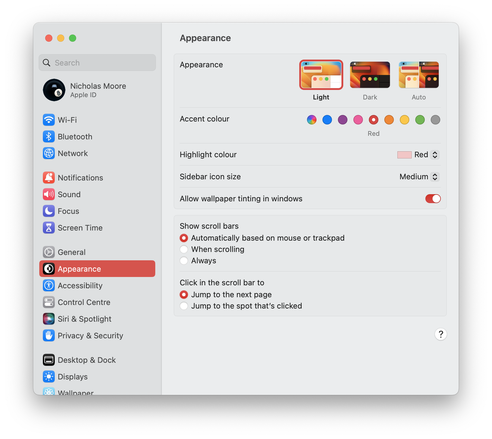

# Settings

This page will give you a comprehensive overview of PopClip's settings.

## The settings menu

PopClip's settings menu is accessed by clicking the  icon in the menu bar.

The settings menu has five panes: [ Home](#home-pane), [ Options](#options-pane), [ Actions](#actions-pane), [ Excluded Apps](#excluded-apps-pane) and [ About](#about-pane).

### Turn PopClip On and Off

The large button at the top showing **ON** and **OFF** controls whether PopClip appears automatically when you select text.

As a short-cut, you can also toggle PopClip on and off by secondary clicking (Right-click or Control-click) the PopClip icon in the menu bar.

On/off state can also be set with [AppleScript](/kb/applescript).

:::tip Still works when off!
Even when PopClip is turned off, you can use the [keyboard shortcut](./basics#activate-with-a-keyboard-shortcut) to make PopClip appear.
:::

##  Home pane

<figure>
  
  
  <figcaption>Home pane: Standalone edition (left), Mac App Store and Setapp editions (right).</figcaption>
</figure>

### App settings

- **Start at login:** When enabled, PopClip will start automatically when you log in to your Mac. *(Default: Off)*
- **Show in menu bar:** When disabled, the icon will be hidden from the menu bar. To show PopClip's settings when the icon is hidden, double-click the PopClip app in your Applications folder. *(Default: On)*
- **Check for updates** (Standalone edition only): When enabled, PopClip will check for updates automatically in the background. You can trigger an immediate update check by un-checking and re-checking this option. *(Default: On)*

:::tip Mac App Store and Setapp editions
If you have the Mac App Store or Setapp edition, you will not see the *Check for updates* option. Updates are managed by the Mac App Store or Setapp.
:::

### Quit PopClip

At the bottom of the Home pane is the **Quit** button. Click this button to quit PopClip.

##  Options pane

### Appearance settings

- **Size:** Choose the size of the PopClip bar, with presets 1—4 from smallest to largest. *(Default: Size 2)*

- **Color:** Choose the color of the PopClip bar:
  - **Dark:** Dark appearance.
  - **Light:** Light appearance.
  - **Auto:** *(Default)* Automatically set dark or light appearance to match the system setting.
  - **Auto (Inverse):** Automatically set dark or light appearance opposite to the system setting.

:::details How to set the system dark/light mode
The system dark/light mode is controlled by the Appearance pane in System Settings. PopClip will also follow the system accent color for both the settings window and the PopClip bar.

:::

### Keyboard Shortcut

Set a keyboard shortcut for making PopClip appear. See [Activate with a keyboard shortcut](./basics#activate-with-a-keyboard-shortcut) for details on using it.

- To set the keyboard shortcut, click the Record Shortcut button and then press the keys you want to use. The key combination must include at least one of the modifer keys ⌃, ⌥, and ⌘.

- To remove or change the keyboard shortcut, click the button and then press the new keys or click the 'X' button.

:::tip Choosing a keyboard shortcut
You can use any key combination you like, but it's good to pick somehting that's easy to remember and doesn't conflict with other common shortcuts. Personally, I use ⌃⌘P.
:::

##  Actions pane

The Actions pane lists all the actions that are currently installed.

:::tip Built-in actions
For details about the built-in actions and their settings, see [Actions](/guide/actions).
:::

### Action settings

You can enable or disable actions by checking or un-checking the box next to the action name. Click the cog icon () next to the action name to access that action's settings.

Clicking the Plus () button will take you to the [extensions directory](/extensions/).

#### Re-ordering actions

To re-order the actions, drag an action's icon up or down in the list.

::: info Spelling action
The Spelling action is always at the top of the list and can't be moved.
:::

#### Deleting actions

To delete an action, first click the Pencil icon () to enter edit mode. Then click the Delete button () next to the action you want to delete. Click the Done button to exit edit mode.

::: info Actions that can't be deleted
The Delete button is shown for extensions only. You cannot delete the built-in actions.
:::

##  Excluded Apps pane

The Excluded Apps pane lets you choose certain apps that PopClip will not appear automatically in.

::: tip Keyboard shortcut still works
Even when PopClip is excluded from an app, you can still use the [keyboard shortcut](./basics#activate-with-a-keyboard-shortcut) to make PopClip appear in that app.
:::

- Click the Plus button () to open the file browser and choose an app to exclude.
- Or, Option(⌥)-click the Plus button to add the frontmost app to the list.
- To remove an app from the list, select it in the list and click the Minus button ().

##  About pane

<figure>  
  
  
  <figcaption>About pane: Mac App Store  edition (left), Standalone edition in trial mode (right).</figcaption>
</figure>

The About pane shows information about the version and edition of PopClip you are using.

::: info Version numbers
See [Version numbers](/kb/files#version-numbers) for details about PopClip's version numbering scheme.
:::

### Licensed mode

When you are running a licensed copy of PopClip, there are three icon buttons at the bottom of the About pane:

-  Help button: Opens this user guide in your browser.
-  Envelope button: Open a new email message to send to the developer.
-  Twitter button: Opens [PopClip's Twitter page](/support).

The text button at the bottom of the About pane differs between editions:

- **View License** (Standalone edition): Opens a window showing your license details.
- **Rate on App Store** (Mac App Store edition): Opens the Mac App Store page for PopClip.
- **Release Notes** (Setapp edition): Opens the Setapp release notes window.

### Trial mode

In trial mode (Standalone edition only), the About pane will instead show the number of uses remaining before the trial expires. The Buy button () Opens the [buy](/buy) page in your browser.
