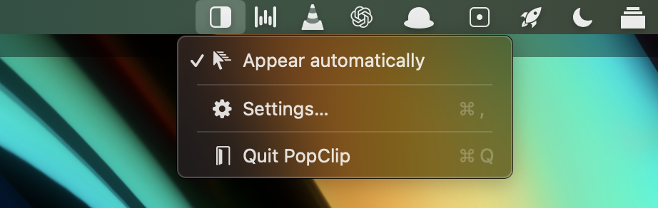

# Settings

This page gives an overview of PopClip's status menu and settings window.

## The status menu

PopClip's status menu is accessed by clicking the&#x00A0;<StatusIconInline /> icon in the menu bar.

The status menu has three items:

- <InlineIcon spec="symbol:pointer.arrow.motionlines" /> **Appear automatically:** A toggle item that turns [automatic appearance](#appear-automatically) on or off.
- <InlineIcon spec="symbol:gearshape.fill" /> **Settings...:** Opens the settings window. Shortcut: `⌘,`
- <InlineIcon spec="symbol:door.left.hand.open" /> **Quit PopClip:** Quits PopClip. Shortcut: `⌘Q`

## The settings window

You can open the settings window from the status menu, by double-clicking
PopClip in the Applications folder while it is already running, or with
[AppleScript](/kb/applescript).

:::tip Keyboard shortcuts
When the settings window has focus, press `⌘W` to close it or `⌘Q` to quit PopClip.
:::

The settings window has three tabs: <InlineIcon spec="symbol:lightswitch.off.square.fill" />
**General**, <InlineIcon spec="symbol:puzzlepiece.extension" />
**Actions** and <StatusIconInline /> **App**.

## <InlineIcon spec="symbol:lightswitch.off.square.fill" /> General tab

The General tab contains the settings for when PopClip appears and how it looks.

### <InlineIcon spec="symbol:pointer.arrow.motionlines" /> Appear automatically

When enabled, PopClip appears automatically when you
[select text with the pointer](./basics#appear-when-selecting-text), or when
you [click and hold](./basics#appear-without-selecting-text). When disabled,
PopClip appears only when you trigger it manually with the [keyboard shortcut](#keyboard-shortcut) or [AppleScript](/kb/applescript).

### <InlineIcon spec="symbol:nosign" /> Rules

Click **Apps...** or **Websites...** to choose where PopClip should not appear
automatically.

:::info Website rules
Website rules only work in supported browsers. See
[Browser support for website exclusion](/kb/notes#browser-support-for-website-exclusion).
:::

### <InlineIcon spec="symbol:keyboard" /> Keyboard shortcut

Set a keyboard shortcut for making PopClip appear. See
[Appear with a keyboard shortcut](./basics#appear-with-a-keyboard-shortcut)
for details on using it.

- To set or change the keyboard shortcut, click the shortcut field and then
  press the keys you want to use.
- The key combination must include at least one of the modifier keys ⌃, ⌥ or ⌘.

:::tip Choosing a keyboard shortcut
You can use any key combination you like,
but it is best to pick something memorable that does not conflict with other
common shortcuts. Personally, I use ⌃⌘P.
:::

### Appearance

- **Size:** Adjust the size of the PopClip bar with the slider. The preview on
  the right updates immediately.
- **Colour:** Choose PopClip's light, dark or automatic colouring.
- **Position:** Choose whether the PopClip bar appears above or below the
  selected text.

::: info Note on position

The position setting only applies when you select a single line of text. If the
selection includes multiple lines, the bar will appear below the pointer if you
made the selection by moving the mouse downwards, and above the selection if you
made the selection by moving the mouse upwards. This is to avoid the bar
obscuring the selection.

:::

## <InlineIcon spec="symbol:puzzlepiece.extension" /> Actions tab

The Actions tab lists all the built-in actions and installed extensions.

:::tip Built-in actions
For details about the built-in actions and their settings, see
[Actions](/guide/actions).
:::

### Action settings

Turn actions on or off using the checkbox next to each action name. Click the
cog button (<InlineIcon spec="bundle:gear" />) next to an action name to access
that action's settings.

Click **Get Extensions** to open the [extensions directory](/extensions/).

#### Re-ordering actions

To re-order the actions, drag the handle at the far right of an action row up or
down in the list.

::: info Spelling action
The Spelling action is always at the top of the list and can't be moved.
:::

## <StatusIconInline /> App tab

The App tab contains information about your copy of PopClip and app-wide
settings.

The top of the tab shows your PopClip version and edition (Standalone or Setapp). The
links underneath open the PopClip website <InlineIcon spec="symbol:globe" />,
this user guide <InlineIcon spec="symbol:book.closed" />, an email to the developer <InlineIcon spec="symbol:envelope" />, and the [PopClip Forum](https://forum.popclip.app/) <InlineIcon spec="symbol:bubble.left.and.bubble.right" />.

### Software Update

In the Standalone edition, the **Software Update** section shows whether PopClip
is up to date and when it last checked for updates.

The <InlineIcon spec="symbol:arrow.clockwise" /> menu provides these options:

- <InlineIcon spec="symbol:arrow.clockwise" /> **Check for updates** checks immediately. Shortcut: `⌘R`
- **Automatic updates** lets you choose **Off**, **Notify only** or
  **Install automatically**.
- **Include beta versions** controls whether to consider beta versions when checking for updates.

### Your License

The **Your License** section shows the current license status.

- **License Details...**: Opens a window showing your
  license details.

In trial mode, this section instead shows the remaining trial usage, together
with a button to open the [buy](/buy) page.

:::tip <SetappInline /> Setapp edition
If you have the Setapp edition, the Software Update and Your License sections will be absent,
because PopClip access and updates are managed by Setapp.
:::

### App Settings

- **Start at login:** When enabled, PopClip starts automatically when you log in
  to your Mac.
- **Show in menu bar:** When enabled, the PopClip icon is shown in your menu
  bar. To show PopClip's settings again after disabling this option,
  double-click PopClip in the Applications folder while it is running.

The <InlineIcon spec="symbol:line.3.horizontal" /> menu provides these
commands:

- <InlineIcon spec="symbol:ant" /> **Debug Console...** opens a console showing debug output that can help with
  diagnosing problems.
- <InlineIcon spec="symbol:door.left.hand.open" /> **Quit PopClip** quits PopClip. Shortcut: `⌘Q`
