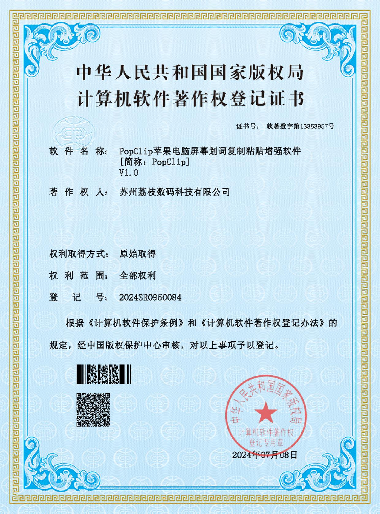

# China Intellectual Property Rights Statement

致有关人士，

长久以来，软件 PopClip 在中国市场的用户体验不断提升，离不开 Pilotmoon Software 与 苏州荔枝数码科技有限公司 (下文简称为 "数码荔枝") 的紧密合作。合作内容包括：中文本地化改进、软件代码编写、中国用户意见收集。

介于此，Pilotmoon Software 授权数码荔枝为大中国区独家合作伙伴，并赋予后者相关权利与责任，包括但不仅限于：
-	负责 PopClip 在中国大陆市场的直接销售 (lizhi.shop & digitalychee.taobao.com)、市场营销、二级分销；
-	维护 PopClip 在中国地区的合规性，如：以数码荔枝作为权利所有人，登记并取得相关软件的计算机软件著作权；
-	移除 PopClip 在中国地区的盗版 & 未授权的销售渠道。

原则上，如果本页面可被正常访问并浏览，即表示双方的合作 (包括对应的权利与责任) 仍处于生效状态。

To Whom It May Concern,

For a long time, the user experience of the PopClip in the Chinese market has been improving without the close cooperation between Pilotmoon Software and SUZHOU DIGITALYCHEE TECHNOLOGY CO., LTD (hereinafter referred to as DIGITALYCHEE). The cooperation includes: Chinese localization improvement, source code writing, and user opinion collection.

In view of this, Pilotmoon Software authorizes DIGITALYCHEE to be the exclusive Chinese partner and grants the latter relevant rights and responsibilities, including but not limited to:
-	Responsible for the direct sales of PopClip in mainland China (lizhi.shop & digitalychee.taobao.com), marketing and secondary distribution.
-	Maintaining PopClip compliance in China, e.g., registering and obtaining computer software copyrights for relevant software(s) with DIGITALYCHEE as the rights owner.
-	Removing PopClip from pirated websites & unauthorized sales channels in Chinese Internet.

In principle, if this page can be accessed and viewed normally, it means that the cooperation between the two parties (including the corresponding rights and responsibilities) is still in effect.

