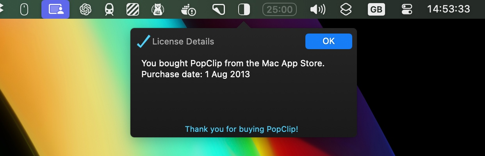
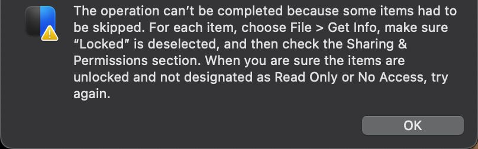
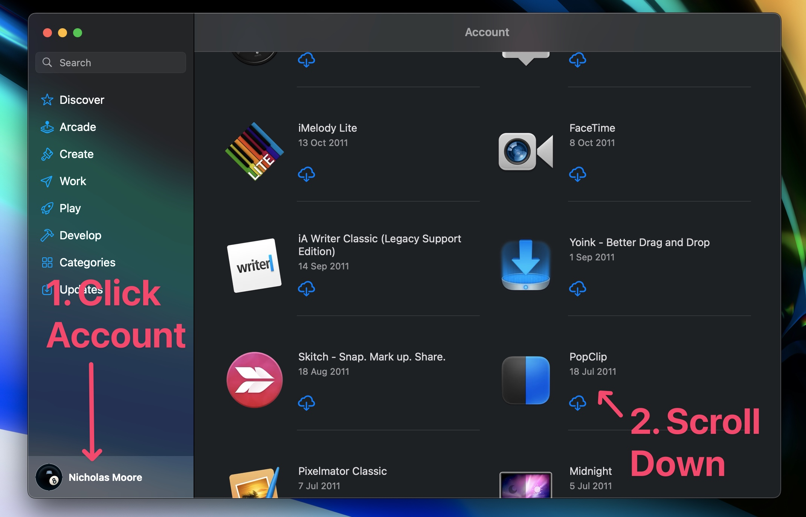

# Migrate from the Mac App Store (MAS) edition to the Standalone edition

The last released version of PopClip on the Mac App Store is 2023.9. If you have
the MAS edition of PopClip, you can migrate for free to the Standalone edition
to continue receiving updates.

::: info From the developer

I apologise for the inconvenience of having to migrate away from the Mac App
Store. I wrote an explanation for why PopClip left the store in a
[forum post](https://forum.popclip.app/t/popclip-is-leaving-the-mac-app-store/2188).
Thank you for your support and understanding. —Nick Moore, PopClip developer.

:::

## How to migrate

1. Quit the MAS edition of PopClip, if it is running.
2. Use Finder to move the the MAS edition of PopClip from the
   `/Applications` folder to the Trash. (Don't use
   an app cleaner or uninstaller tool, as that will likely delete your settings
   and extensions.)
3. Download PopClip from the [download](/download) page, and unzip it.
4. Put it in the `/Applications` folder.
5. Run the new PopClip app. It will detect your Mac App Store purchase and
   unlock itself.

::: details Alternative: migrate using Homebrew

[Homebrew](https://brew.sh/) users can perform the migration with this command:

```
killall PopClip; brew reinstall popclip --force
```

:::

You can confirm the unlocked status by clicking View License in the About pane
of PopClip's settings menu.



## ...I get this weird macOS error though

> The operation can't be completed because some items had to be skipped. For
> each item, choose File > Get Info, make sure "Locked" is deselected, and then
> check the Sharing & Permissions section. When you are sure the items are
> unlocked and not designated as Read Only or No Access, try again.



This Finder error occurs on macOS Sequoia if you ignore step 2 of the
instructions and try to drag the new app over the existing MAS edition without
deleting it first. To avoid this error message you must manually trash the MAS edition first.

## ...but I don't have MAS PopClip already installed and it's not available in the store!


Even though PopClip is not searchable in the MAS storefront, it is still part of
your purchased apps list. Install it by going to your account screen in the MAS
and scroll down the Purchased list (it's ordered by purchase date, so you might
have to scroll a long way if you bought it a long time ago).



In case the MAS fails to install PopClip from Purchased list, ensure that there
are no other copies of PopClip anywhere (e.g. in Applications or Downloads
folder), and try again.

After installing PopClip from the MAS, run it once, quit it, and then follow the
steps in [How to migrate](#how-to-migrate) above.

## ...but what about installing in future on a new Mac?

You may be thinking that you have to mess about installing the MAS edition
first, then the Standalone edition, whenever you install PopClip on a new Mac.
Not so!

In future, the Standalone edition will detect a proof your MAS purchase in
iCloud and unlock itself.

This assumes you have iCloud enabled on your Mac now, and you use the same
iCloud account on the new Mac.

## Migration FAQs

- **What happens to my settings and extensions?**<br>Your settings and
  extensions will be preserved when you migrate to the Standalone edition.<br>
  _Important: do not use an app cleaner or uninstaller tool to remove the MAS
  edition! That will likely delete your settings and extensions._

- **How will I get future updates?**<br>After migrating to the Standalone
  edition, you will receive updates automatically through the in-app update
  mechanism. Make sure that "Check for updates" is enabled in the PopClip
  preferences.

- **Are there any differences between the MAS and Standalone editions?**
  <br>There are no functional differences between the MAS and Standalone
  editions. They are both built from the exact same codebase. Only the method of
  distribution is different.

- **How can I tell which edition of PopClip I have?**<br>In the PopClip
  preferences window, the About pane shows the edition of PopClip you are using.

- **Can I get a license key for the Standalone edition?**<br>License keys can be
  purchased on the [buy](/buy) page. I am currently offering MAS customers a 50%
  discount. Please email proof of your MAS purchase to my
  [support email](/support).


