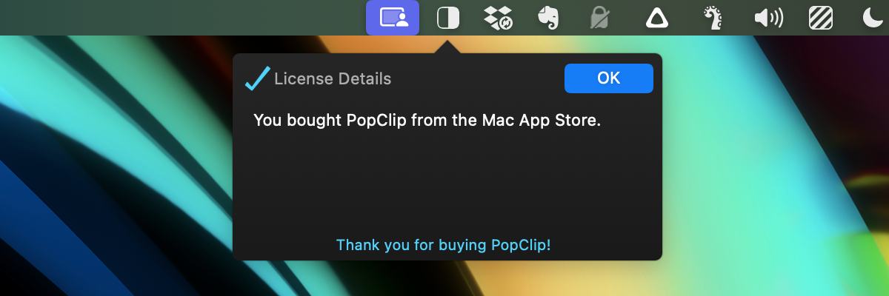
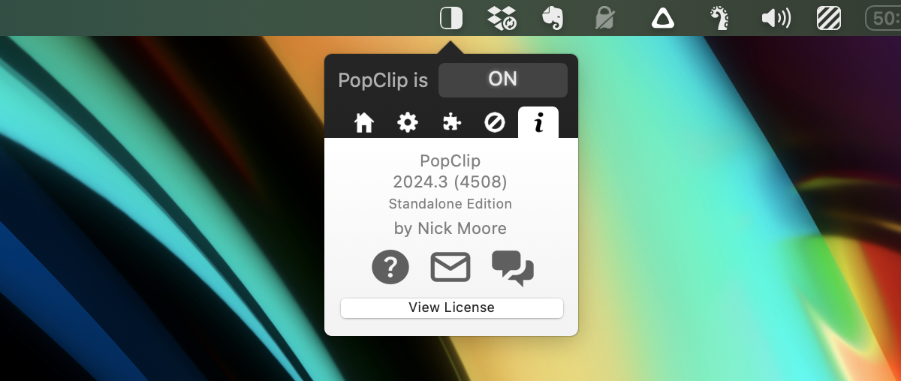

# Migrate from the Mac App Store (MAS) edition to the Standalone edition

The last released version of PopClip on the Mac App Store is 2023.9. This is the
final update that will be available through the store.

If you have the MAS edition of PopClip, you can migrate for free to the
Standalone edition to continue receiving updates.

::: info From the developer

I apologise for the inconvenience of having to migrate away from the Mac App
Store. I wrote an explanation for why PopClip left the store in a
[forum post](https://forum.popclip.app/t/popclip-is-leaving-the-mac-app-store/2188).
Thank you for your support and understanding. —Nick Moore, PopClip developer.

:::

## How to migrate

1. Quit your existing PopClip, if it is running.
2. Download PopClip from the [download](/download) page, and unzip it.
3. Put it in the `/Applications` folder, replacing the MAS edition. (MacOS will
   ask for your password to confirm deletion of the MAS edition.)
4. Run the new PopClip app. It will detect your Mac App Store purchase and
   unlock itself.

::: details Alternative: migrate using Homebrew

[Homebrew](https://brew.sh/) users can perform the migration with one command:

```
killall PopClip; brew reinstall popclip --force
```

:::

You can confirm the unlocked status by clicking View License in the About pane
of PopClip's settings menu.



## Installing in future on a new Mac

You may be thinking that you have to mess about installing the MAS edition
first, then the Standalone edition, whenever you install PopClip on a new Mac.
Not so!

In future, the Standalone edition will detect a proof your MAS purchase in
iCloud and unlock itself.

This assumes you have iCloud enabled on your Mac now, and you use the same
iCloud account on the new Mac.

## Fallback method

If the Standalone edition did not unlock itself automatically, refresh the MAS
receipt by following these steps:

1. Install the Mac App Store edition of PopClip 2023.9. You can find it in the
   Purchased section your account page in the MAS.
2. Run PopClip (MAS edition) once, then quit it.

Then follow the steps in [How to migrate](#how-to-migrate) above.

## Migration FAQs

- **What happens to my settings and extensions?**<br>Your settings and
  extensions will be preserved when you migrate to the Standalone edition.<br>
  _Important: do not use an app cleaner or uninstaller tool to remove the MAS
  edition! That will likely delete your settings and extensions._

- **How will I get future updates?**<br>After migrating to the Standalone
  edition, you will receive updates automatically through the in-app update
  mechanism. Make sure that "Check for updates" is enabled in the PopClip
  preferences.

- **Are there any differences between the MAS and Standalone editions?**
  <br>There are no functional differences between the MAS and Standalone
  editions. They are both built from the exact same codebase. Only the method of
  distribution is different.

- **How can I tell which edition of PopClip I have?**<br>In the PopClip
  preferences window, the About pane shows the edition of PopClip you are using.

- **Can I get a license key for the Standalone edition?**<br>I am currently
  offering MAS customers a 50% discount on a license key for the Standalone
  edition. Please email proof of your MAS purchase to my
  [support email](/support).


